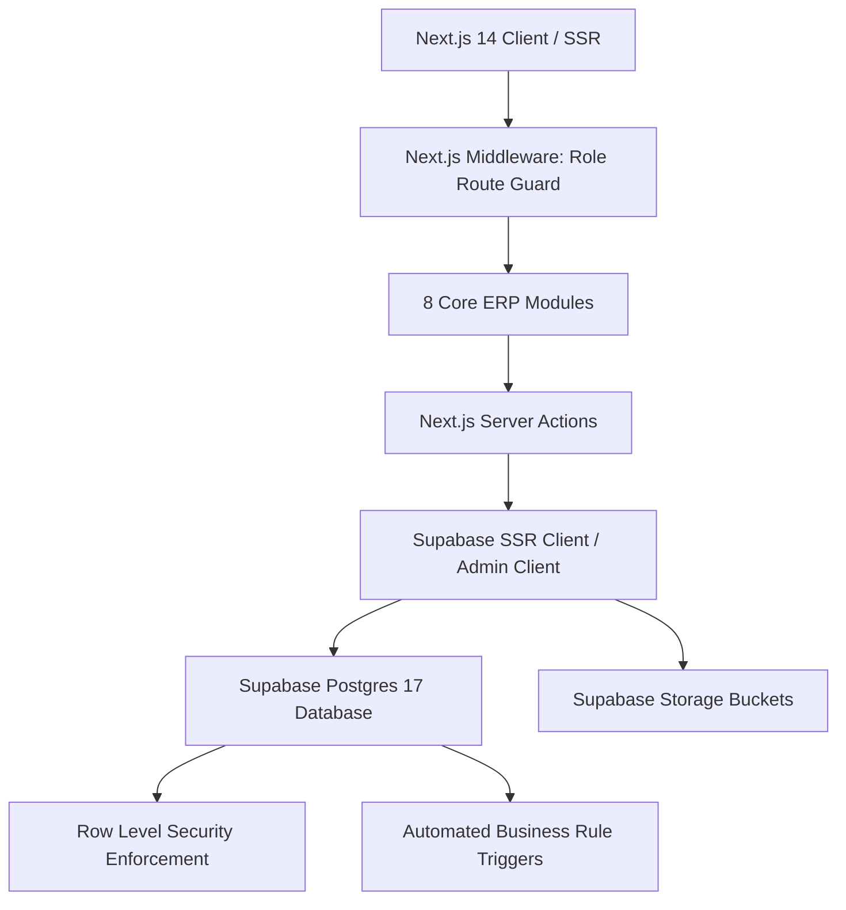

# Sunfraa Global ERP — Complete System & Feature Documentation

> **Platform Overview**: A multi-role Solar EPC (Engineering, Procurement, and Construction) operations and Enterprise Resource Planning platform built with Next.js 14 App Router, TypeScript, Tailwind CSS, Supabase (PostgreSQL 17, Row Level Security, Auth, Storage), and the Airtable workflow design system.

---

## Table of Contents

1. [System Architecture & Tech Stack](#1-system-architecture--tech-stack)
2. [User Roles & Permissions Matrix](#2-user-roles--permissions-matrix)
3. [Database Architecture & Data Model (16 Tables)](#3-database-architecture--data-model-16-tables)
4. [Security, Row Level Security (RLS) & Triggers](#4-security-row-level-security-rls--triggers)
5. [Supabase Storage Buckets](#5-supabase-storage-buckets)
6. [Automated Business Rule Triggers & Routines](#6-automated-business-rule-triggers--routines)
7. [Comprehensive Module Breakdown](#7-comprehensive-module-breakdown)
   - [Module 1: Sales Pipeline](#module-1-sales-pipeline)
   - [Module 2: Accounts Dashboard](#module-2-accounts-dashboard)
   - [Module 3: Project Execution](#module-3-project-execution)
   - [Module 4: Director Approvals](#module-4-director-approvals)
   - [Module 5: Store & Purchase](#module-5-store--purchase)
   - [Module 6: Design Team](#module-6-design-team)
   - [Module 7: Liaisoning & CEI](#module-7-liaisoning--cei)
   - [Module 8: Manager Control (Admin)](#module-8-manager-control-admin)
8. [Airtable Design System Implementation](#8-airtable-design-system-implementation)
9. [Default Credentials & Access Guide](#9-default-credentials--access-guide)

---

## 1. System Architecture & Tech Stack

- **Frontend**: Next.js 14.2 (App Router, Server Components, Server Actions).
- **Backend / BaaS**: Supabase (PostgreSQL 17.6, Supabase Auth, Storage, Edge functions/Cron).
- **Language & Types**: TypeScript (strict type checking across database models and client components).
- **Styling & UI**: Tailwind CSS with custom Airtable design tokens (`DESIGN.md`), Lucide Icons.

---

## 2. User Roles & Permissions Matrix

The ERP implements 7 primary operational roles with strict database-level and middleware-level boundaries:

| Role | Access Scope | Primary Actions | Default Landing |
|---|---|---|---|
| **`DIRECTOR`** | **Full System (All 8 Modules)** | Lead management, project approvals, user administration, override permissions | `/pipeline` |
| **`SALES`** | Sales Pipeline only | Lead intake, client follow-up, quotation dispatch logging (scoped to own leads) | `/pipeline` |
| **`ACCOUNTS`** | Accounts & Pipeline | Payment verification, payment collection recording, financial analytics | `/accounts` |
| **`SITE_EXECUTION`** | Project Execution & Surveys | Site survey submission, labour management, 4-stage execution progress, serial number scans | `/execution` |
| **`STORE_PURCHASE`** | Store & Purchase | Bill of Materials (BOM) management, stock ledger (IN/OUT), Delivery Challan creation | `/store` |
| **`DESIGN`** | Design Team & CAD | Initial CAD drawing uploads, CEI drawing revisions | `/design` |
| **`LIAISONING`** | Liaisoning & CEI | DISCOM filing, government estimate logging, CEI portal sync, meter sync reports | `/liaisoning` |

---

## 3. Database Architecture & Data Model (16 Tables)

The database schema is fully normalized in Supabase PostgreSQL across 16 core domain tables and 8 custom Postgres enums.

### Custom Postgres Enums
1. `user_role`: `DIRECTOR`, `SALES`, `ACCOUNTS`, `SITE_EXECUTION`, `STORE_PURCHASE`, `DESIGN`, `LIAISONING`
2. `project_category`: `RESIDENTIAL_BUNGALOW`, `RESIDENTIAL_FLAT`, `COMMERCIAL`, `INDUSTRIAL`
3. `project_stage`: `LEAD`, `SITE_SURVEY_SCHEDULED`, `SITE_SURVEY_DONE`, `DESIGN_PENDING`, `DESIGN_UPLOADED`, `QUOTATION_SENT`, `STALE`, `PAYMENT_COLLECTED`, `DIRECTOR_APPROVED`, `EXECUTION_IN_PROGRESS`, `EXECUTION_COMPLETE`, `LIAISONING_IN_PROGRESS`, `CEI_IN_PROGRESS`, `CONNECTED`, `CLOSED`
4. `payment_status`: `PENDING`, `COLLECTED`
5. `design_file_type`: `INITIAL`, `CEI_DRAWING`
6. `stock_direction`: `IN`, `OUT`
7. `execution_stage`: `STRUCTURE_FABRICATION`, `PANEL`, `WIRING`, `CIVIL`
8. `completion_capture_method`: `SCAN`, `PHOTO_OCR`

### Table Summary

| Table | Relationship | Key Fields & Constraints |
|---|---|---|
| **`profiles`** | 1:1 with `auth.users` | `id (UUID)`, `name`, `phone`, `role (user_role)`, `active (boolean)` |
| **`projects`** | Central Entity | `client_name`, `address`, `category`, `kw_required`, `stage`, `quotation_amount`, `payment_status`, `cei_required (computed: kw > 10)` |
| **`site_surveys`** | 1:1 with `projects` | `no_of_panels`, `physical_measurement`, `photo_urls`, `diagram_urls`, `gps_location`, `surveyed_by_id` |
| **`design_files`** | 1:N with `projects` | `type (INITIAL | CEI_DRAWING)`, `file_url`, `version`, `uploaded_by_id` |
| **`boms`** | 1:1 with `projects` | `created_by_id`, `created_at` |
| **`bom_items`** | 1:N with `boms` | `bom_id`, `item_name`, `category`, `quantity`, `unit` |
| **`delivery_challans`**| 1:N with `projects` | `vehicle_type`, `registration_number`, `driver_name`, `driver_mobile`, `distance` |
| **`stock_ledger`** | Relational Ledger | `item_name`, `direction (IN | OUT)`, `quantity`, `project_id`, `delivery_challan_id`. **CHECK Constraint**: Stock OUT requires valid challan & project |
| **`labour_teams`** | Independent Entity | `name`, `headcount`, `available` |
| **`labour_assignments`**| Join Entity | `labour_team_id`, `project_id`, `stage`, `assigned_date`. **UNIQUE Constraint**: `(labour_team_id, assigned_date)` |
| **`execution_stage_progress`** | 1:N with `projects` | `stage (FABRICATION, PANEL, WIRING, CIVIL)`, `photo_url`, `comment`, `completed_at` |
| **`execution_completions`** | 1:1 with `projects` | `panel_serial_numbers (text[])`, `panel_count`, `inverter_serial_number`, `captured_via` |
| **`follow_up_logs`** | 1:N with `projects` | `reminder_sent_at`, `assigned_to_id`, `acknowledged (boolean)` |
| **`liaisoning_records`** | 1:1 with `projects` | `documents_received_at`, `acknowledgement_number`, `govt_estimate_amount`, `estimate_paid_at`, `connected_at`, `meter_report_url` |
| **`discom_follow_up_logs`**| 1:N with `liaisoning`| `liaisoning_record_id`, `follow_up_date`, `note`, `logged_by_id` |
| **`cei_records`** | 1:1 with `projects` | `self_certificate_generated_at`, `cei_portal_reference_number`, `cei_approved_at`, `inspector_name`, `inspector_date` |

---

## 4. Security, Row Level Security (RLS) & Triggers

1. **`auth_role()` Helper Function**:
   - `SECURITY DEFINER` function with hardened search path: `SET search_path = public, pg_temp`.
   - Returns the active role for `auth.uid()`.
   - Execution restricted to authenticated users and database engine.

2. **Row Level Security (RLS)**:
   - Enabled on **all 16 tables**.
   - `projects`: Sales can only view and update their own leads (`lead_owner_id = auth.uid()`). Directors and cross-functional operational teams have scoped view access.
   - `profiles`: All authenticated users can read team profiles; only Directors can manage profiles.

3. **Field Mutation Guard Trigger (`trg_check_project_field_permissions`)**:
   - **Payment Protection**: Only `ACCOUNTS` or `DIRECTOR` can mutate `payment_status`, `payment_collected_at`, or `payment_collected_by_id`. Any direct attempt by Sales or other roles fails with a database exception.
   - **Approval Protection**: Only `DIRECTOR` can set `director_approved_at` or `director_approved_by_id`.

---

## 5. Supabase Storage Buckets

Four private storage buckets are configured with granular RLS policies on `storage.objects`:

1. **`site-survey-photos`**: Site survey measurements, rooftop photos, and diagrams (read: Execution, Sales, Design, Director; write: Execution, Director).
2. **`design-files`**: CAD layouts, single line diagrams (SLDs), and CEI drawings (read: Design, Sales, Liaisoning, Director; write: Design, Director).
3. **`delivery-challans`**: Scanned dispatch receipts and delivery vehicle documents (read/write: Store & Purchase, Director).
4. **`meter-reports`**: Bi-directional meter installation synchronization reports and DISCOM certificates (read: Liaisoning, Accounts, Director; write: Liaisoning, Director).

---

## 6. Automated Business Rule Triggers & Routines

- **Business Rule 1 & 2 (Quotations & Reminders)**:
  - `process_stale_quotations()`: Automatically marks quotations in `QUOTATION_SENT` as `STALE` after 15 days without payment.
  - `process_quotation_follow_ups()`: Generates sales follow-up reminder logs every 3 days while in quotation stage.
- **Business Rules 4 & 12 (Payment Collection Automation)**:
  - `trg_on_project_payment_collected`: Automatically advances project to `PAYMENT_COLLECTED` and instantiates the 1:1 `LiaisoningRecord` upon payment verification.
- **Business Rule 6 (Director Approval BOM Handoff)**:
  - `trg_on_project_director_approved`: Automatically advances stage to `DIRECTOR_APPROVED` and creates a `BOM` shell for Store & Purchase.
- **Business Rules 7 & 8 (Labour Team Booking & 4-Stage Execution)**:
  - Database-level unique constraint prevents double-booking labour teams on the same calendar day across projects.
  - Execution stages enforce sequential completion (`FABRICATION` &rarr; `PANEL` &rarr; `WIRING` &rarr; `CIVIL`).
- **Business Rule 9 (Execution Completion Handoff)**:
  - `trg_on_execution_completion_created`: On completion, inspects `cei_required`:
    - If `kw_required > 10`: Advances to `CEI_IN_PROGRESS` and instantiates `CEIRecord`.
    - If `kw_required <= 10`: Advances directly to `LIAISONING_IN_PROGRESS`.

---

## 7. Comprehensive Module Breakdown

### Module 1: Sales Pipeline
- **`/pipeline`**: Kanban board and spreadsheet grid view of all solar projects by stage.
- **`/pipeline/new`**: Lead intake form with automatic CEI detection (>10kW alert) and lead assignment.
- **`/pipeline/[projectId]`**: Detailed project workspace with Lead Info, Site Survey results, CAD drawings preview, Quotation Dispatch logger, and 3-day Follow-up reminder logs.
- **`/pipeline/[projectId]/site-survey`**: Mobile-optimized on-site survey form for site engineers to capture GPS coordinates, panel capacity, physical measurements, contact info, and upload photos.

### Module 2: Accounts Dashboard
- **`/accounts`**:
  - Top metric cards: Active Projects, Payments Pending (count & value), Payments Collected MTD.
  - Interactive table: Client, Category, kW, Stage, Quotation Amount, Payment Status, Days Since Quote Sent, and Stale badge.
  - **Mark Payment Collected**: Modal action that writes `payment_status = 'COLLECTED'` and triggers automated downstream stages.

### Module 3: Project Execution
- **`/execution`**: Execution project queue for all Director-approved projects.
- **`/execution/[projectId]`**:
  - Labour team daily assignment manager (with conflict prevention).
  - 4-stage sequential progress timeline with on-site photo upload.
  - Final execution completion logger with panel serial number capture (OCR/manual) and inverter serial tracking.

### Module 4: Director Approvals
- **`/director/approvals`**: Executive gatekeeper queue displaying projects with collected payments ready for site execution signoff. Single-click approval triggers BOM shell generation.

### Module 5: Store & Purchase
- **`/store`**:
  - Bill of Materials (BOM) builder: add and organize items by category (Panels, Inverters, Structures, Balance of System).
  - Inventory Stock Ledger: track all `IN` and `OUT` transactions.
  - Delivery Challan generator: vehicle type, registration, driver mobile, distance calculation, and PDF dispatch notes.

### Module 6: Design Team
- **`/design`**:
  - Initial CAD Drawing Queue: projects with completed surveys awaiting layout drawings.
  - CEI Drawing Revision Queue: >10kW projects requiring specialized CEI electrical single-line diagrams.
  - File uploader with automatic version incrementation.

### Module 7: Liaisoning & CEI
- **`/liaisoning`**:
  - DISCOM tracking: application submission date, official government estimate fee / demand note logging (`govt_estimate_amount`, `govt_estimate_quotation_number`), statutory payment status, and file readiness.
  - CEI tracker (>10kW): portal reference, self-certificate generation, inspection schedule, and inspector contact logging.
  - Final grid synchronization: meter report upload and project stage transition to `CONNECTED`.

### Module 8: Manager Control (Admin)
- **`/admin/users`**: Complete team directory with role badges and active status indicators.
- **`/admin/users/new`**: Create user accounts, assign any of the 7 operational roles, or trigger Supabase email invites.
- **`/admin/users/[userId]`**: Edit user details, switch roles, or instantly deactivate account access.

---

## 8. Airtable Design System Implementation

The application adheres to the Airtable design system specified in `DESIGN.md`:

- **Palette**:
  - Primary Ink: `#181d26` (headers, primary actions, text).
  - Surface Background: `#f8fafc` soft neutral canvas with pure `#ffffff` cards and tables.
  - Hairline Dividers: `#e0e2e6` 1px borders.
  - Signature Accents: Coral (`#aa2d00`), Peach (`#fcab79`), Mint (`#a8d8c4`), Mustard (`#d9a441`), Forest Green (`#0a2e0e`).
- **Interactive Elements**:
  - Primary Pill Buttons: `rounded-full bg-[#181d26] text-white hover:bg-[#0d1218]`.
  - Secondary Outlined Buttons: `rounded-full border border-[#e0e2e6] bg-white text-[#181d26] hover:bg-[#f8fafc]`.
  - View Switcher: Segmented pill controls (`[ ⊞ Board ] [ ☰ Grid ]`).
  - Search: `Find in view...` input fields.

---

## 9. Security, Authentication & Production Deployment Guide

> [!IMPORTANT]
> **Production Password Policy**: For production environments, default temporary passwords must be rotated immediately upon initial setup. User credentials should never be committed to repositories or shared unencrypted.

### Director & User Provisioning
1. **Initial Director Setup**: Provisioned via secure Supabase Auth admin client or SQL migration.
2. **Password Rotation**: Directors and staff should update their passwords immediately upon first login via the user security settings.
3. **Recommended Invite Flow**: User accounts created in `/admin/users` can leverage Supabase's `auth.admin.inviteUserByEmail()` flow, emailing a secure one-time setup link directly to the employee's work email.

### Quick Start Commands
- **Start Development Server**: `npm run dev` (Available on `http://localhost:3000`)
- **Login URL**: `http://localhost:3000/login`
- **Production Build**: `npm run build`

